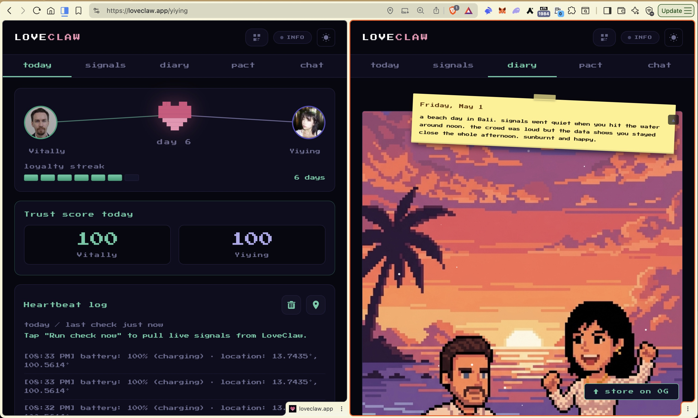
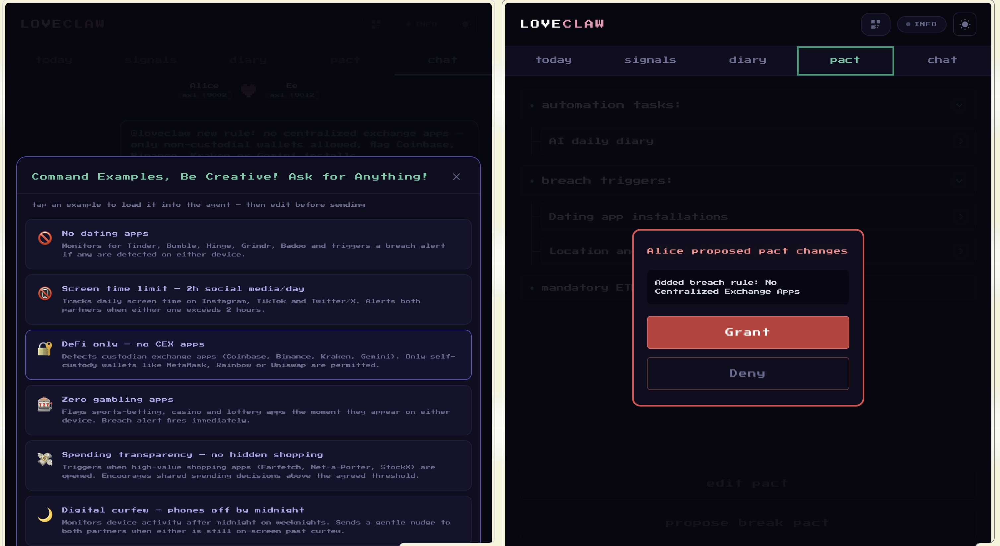

# LoveClaw

**The AI Arbiter for Connected Couples**

**Open Agents 2026** · ETHGlobal

LoveClaw is a relationship trust app for two people who opt into mutual accountability. Each partner installs it on their device, pairs over a QR code or invite link, and from that point on their phones stay in sync peer-to-peer over the AXL mesh network. There is no central couples server. Every AI agent gets minted as an NFT on the 0G Galileo testnet, relationship events are stored permanently on-chain via 0G Memory, and both partners can lock real ETH stakes in a deployed smart contract on Ethereum mainnet. **Together they also manage a mutual on-chain portfolio** from the **Today** dashboard: shared **ETH / USDC** vault balances, live pricing, and **co-approved** token swaps (quotes and execution stay peer-negotiated over AXL until both sides agree).

> Hackathon prototype. Not production security, custody, or legal advice.

## Screenshots

<p align="center">
    <br />
    <sub><b>Diary</b> — auto-generated journal day (sticky + illustration)</sub>
</p>

<p align="center">
    <br />
    <sub><b>Pact</b> — Command Examples modal in chat (<code>@loveclaw</code> presets)</sub>
</p>

---

## How it works

Each partner runs a local AI agent that reads consented device signals: app usage metadata, GPS location, notification categories (not message bodies), screen activity, and presence patterns. The couple agrees on a pact that defines what counts as a breach. If the agents detect a violation, a breach alert fires, the partner is notified over AXL, the event is written to 0G Memory, and if ETH was staked the on-chain penalty logic kicks in.

```
Phone A                                      Phone B
 Local Agent                                  Local Agent
  reads signals                                reads signals
       |                                            |
       +------------- AXL P2P mesh ----------------+
                           |
               Both agents evaluate signals
               against agreed pact rules
                           |
              Breach detected? ----No----> monitoring continues
                    |
                   Yes
                    |
       +------------+------------+
       |                         |
  AXL breach alert          0G Memory
  sent to partner           breach episode
       |                    stored on-chain
       |
  Smart contract
  (ETH stake locked on Ethereum mainnet)
  penalty applied if confirmed by both agents
```

### Pact rules: natural language and what “enforceable” means

**What goes in the pact.** At pairing you combine **preset triggers** (dating installs, location, diary, and similar) with **custom rules in plain language**—full sentences, quoted lines, in-jokes, or “house norms,” however you write them.

**Permissive by design.** **Anything both of you explicitly agree to can live in the pact text.** The only catch is being honest about what the app can *see*: if you both sign up for a rule, it should match what your devices and consent model actually expose.

**What “automated enforcement” really means.** **Automated breach paths only fire** when local agents can **roughly infer** a violation from **signals you already consented to share.** Those signals include things like:

- Installed apps / package names  
- Coarse GPS and presence  
- Notification **categories** (not message bodies)  
- Screen-on patterns  
- Shared diary and chat context  
- Heartbeats and similar device metadata  

**When a rule is only a mutual promise.** If a rule would need proof the stack **cannot** access—or surveillance **outside** those channels—it stays a **mutual promise** between you. Nothing silently trips a “hard” automated breach for that; the product does not pretend it can enforce what it cannot observe.

**Drafting and changes.** Use **`@loveclaw`** in the chat tab to draft or rephrase rules. If a change would alter what gets monitored, it still goes to your partner as **`pact_changes_propose`** over AXL and only applies after they accept.

### `@loveclaw` command examples (in-app presets)

The paired **chat** flow includes a **“Command Examples, Be Creative! Ask for Anything!”** sheet (`#pact-inspire-modal` in [`index.html`](./index.html)). Each row injects an `@loveclaw …` starter into the composer—*tap an example to load it into the agent — then edit before sending*. Presets shipped in the UI:

- **No dating apps** — Monitors for Tinder, Bumble, Hinge, Grindr, Badoo and triggers a breach alert if any are detected on either device.
- **Screen time limit — 2h social media/day** — Tracks daily screen time on Instagram, TikTok and Twitter/X. Alerts both partners when either one exceeds 2 hours.
- **DeFi only — no CEX apps** — Detects custodian exchange apps (Coinbase, Binance, Kraken, Gemini). Only self-custody wallets like MetaMask, Rainbow or Uniswap are permitted.
- **Zero gambling apps** — Flags sports-betting, casino and lottery apps the moment they appear on either device. Breach alert fires immediately.
- **Spending transparency — no hidden shopping** — Triggers when high-value shopping apps (Farfetch, Net-a-Porter, StockX) are opened. Encourages shared spending decisions above the agreed threshold.
- **Digital curfew — phones off by midnight** — Monitors device activity after midnight on weeknights. Sends a gentle nudge to both partners when either is still on-screen past curfew.

---

## Sponsors and integrations

### AXL — peer-to-peer mesh transport

Every message between partners travels over AXL with no server in the middle. This includes breach alerts, diary sync, location heartbeats, pact amendments, swap negotiations, and profile/avatar updates.

Each partner gets a 64-character hex AXL public key. The creator's key is embedded in the invite QR code. When the joiner scans it, their device sends an `axl_handshake` message over AXL to complete pairing. After that all communication is direct P2P.

AXL nodes run locally on `:9002` (creator) and `:9012` (joiner). In development the Vite proxy forwards `/axl9002` and `/axl9012`. In production a Vercel serverless proxy handles the forwarding via `DEMO_AX_9002_URL` and `DEMO_AX_9012_URL` environment variables.

Message types sent over AXL: `axl_handshake`, `breach`, `break_pact_propose`, `break_pact_grant`, `break_pact_deny`, `diary_note`, `diary_note_delete`, `diary_notes_sync`, `pact_changes_propose`, `pact_changes_accept`, `swap_confirm`, `swap_deny`, `swap_execute`, `profile_update`, score updates, location heartbeats, and pings.

Full technical reference: [README_AXL.md](./README_AXL.md)

---

### 0G Foundation — agent NFTs, memory, and storage

0G powers three distinct layers of LoveClaw.

**Agent NFT (ERC-7857 on 0G Galileo testnet)**

Every partner mints a personal AI agent as an NFT on the 0G Galileo testnet using the ERC-7857 Agentic ID standard. The contract is deployed at `0x2700F6A3e505402C9daB154C5c6ab9cAEC98EF1F` on chain ID 16602.

When you tap "Register Agent" in your profile:

1. The app reads the mint fee from the contract and calls `iMint` with your agent's name, model (`claude-sonnet-4-6`), capabilities, and system prompt hashed as data fields.
2. A fresh Ethereum wallet is generated locally and linked to your NFT on-chain via `authorizeUsage` and `delegateAccess`.
3. The agent wallet private key is encrypted with AES-GCM (PBKDF2, 150k iterations) and kept on-device for signing; you never handle the raw key in the UI.
4. Your profile now shows an "OG Agent Address NFT ID #X" badge with a link to the 0G Chainscan explorer. Your partner sees your NFT ID in their profile view of you.
5. The agent wallet address is passed into the `LoveClawPact` smart contract as your authorised breach-filing address. Only that address can submit evidence on-chain.

The agent wallet also signs every 0G Storage upload and is embedded in each diary snapshot as metadata, permanently linking stored files to the on-chain agent identity.

**0G Memory (EverMemOS)**

A Python service (`memory_router.py`) runs at port 9091 as a thin HTTP wrapper around EverMemOS at port 1995. EverMemOS backs everything with MongoDB, Elasticsearch, Milvus for vector search, Redis, and `zgs_kv` which writes to the 0G testnet blockchain.

Episodes are written automatically:

- Breach detected (dating app found) writes a `breach` episode
- Partner first connects writes an `axl_handshake` episode
- Diary entry generated writes a `diary` episode
- Both partners detected at the same location writes a `together` episode

Before generating a diary entry, the app queries 0G Memory with a semantic search to pull relevant past episodes and inject them as context into the AI prompt. This grounds every diary entry in real relationship history.

**0G Storage**

Partners can tap "Store on 0G" in the diary tab to upload a cover image and a full JSON diary snapshot to the 0G Galileo testnet using `@0gfoundation/0g-ts-sdk`. The upload uses `Indexer` and `MemData` from the SDK, signs with the agent wallet, and returns a `rootHash` and `txHash` with direct links to the Galileo storage and chain explorers.

**0G Compute**

In Settings, 0G Compute is available as an AI provider option. When selected, diary generation and breach analysis route to 0G inference instead of a centralised API.

Full technical reference: [README_0G.md](./README_0G.md)

---

### Uniswap — shared vault and token swaps

LoveClaw includes a shared couple vault backed by the Uniswap Trading API v1.

**Mutual portfolio.** After pairing, the **Today** tab is the couple’s **shared money view**: one place to see **mutual budget**, **combined ETH and USDC** balances for the vault narrative, and **ETH priced in USD** from a live Uniswap quote—both partners read the **same** numbers. **Swap** flows are explicitly **two-party**: you propose in natural language, the app fetches a quote, and the **other partner must confirm on their device** over AXL (`swap_confirm` → `swap_execute`) before any signed transaction is broadcast. Neither side can move **mutual** funds alone.

Partners can type natural-language swap commands like "swap 0.1 ETH for USDC". The app parses the intent, fetches a quote from `POST /uniswap/v1/quote`, and then negotiates the swap peer-to-peer over AXL before broadcasting anything. Both partners must confirm before `POST /uniswap/v1/swap` is called and the signed transaction is broadcast via ethers.

The vault display shows live ETH and USDC balances and prices ETH in USD using a real-time Uniswap quote. The Uniswap API is proxied through Vite in development (`/uniswap` rewrites to `trade-api.gateway.uniswap.org`) and through Vercel in production.

Full technical reference: [README_UNISWAP.md](./README_UNISWAP.md)

---

## Smart contract: LoveClawPact

**Deployed and verified on Ethereum mainnet.**

| Field | Value |
|---|---|
| Address | [`0x597a01608952220f1d833c833111731E6762085c`](https://etherscan.io/address/0x597a01608952220f1d833c833111731e6762085c) |
| Network | Ethereum mainnet (chain 1) |
| Verified | [Etherscan source](https://etherscan.io/address/0x597a01608952220f1d833c833111731e6762085c#code) |
| Source | `evm/src/LoveClawPact.sol` |
| Compiler | Solidity 0.8.30, optimizer 200 runs |

Both partners lock ETH when creating and joining a pact. Each partner assigns an AI agent address (derived from their 0G agent wallet). Only those agent addresses can file breach evidence on-chain. Neither partner can file against themselves.

The contract supports two breach modes. In instant breach, both agents must agree before any funds move. In delayed breach, one agent files evidence and the accused partner has a dispute window (default 24 hours, max 7 days) to challenge it. If unchallenged, the innocent partner claims the full stake.

---

## Screens and flows

```
screen-home
  screen-create  -->  screen-code (QR + invite link, AXL key embedded)
  screen-join    -->  (joiner enters name and invite code)
  screen-paired  -->  screen-dashboard
                        tab: today    (trust score, mutual portfolio / vault, co-approved swaps)
                        tab: signals  (heartbeat map, activity)
                        tab: diary    (AI-generated entries, Store on 0G button)
                        tab: pact     (rules, trigger amendment flow)
  screen-profile (agent NFT registration, AXL key, partner profile view)
```

---

## Signal relay

A Python service in `prototype/relay/` runs at port 9090. It ingests signal batches from the app, runs `breach_ai.py` (Claude-backed breach analysis with keyword fallback), broadcasts events to an operator SSE console at `http://localhost:9090/`, and writes typed episodes to 0G Memory via `memory_client.py`.

---

## AI diary and copilot

The **diary** tab builds an **auto-generated** daily narrative from a context bundle: recent signals, calendar notes, semantic hits from **0G Memory**, and partner-visible history. The write-up is styled like a **retro journal** (sticky date + body copy); the day view can pair that text with a **scene image**—either a **stock illustration** from the shared `prototype/diary/images/` pool or an **AI-generated cover** when you run diary image generation (OpenRouter image path). Both partners see the same entry; updates sync over AXL.

Type `@loveclaw` in the chat tab to use the pact architect: propose new rules, get help phrasing triggers, or ask questions about the pact. The AI responds with structured JSON (`propose_rule`, `need_info`, `chat`) and if a rule is proposed it gets sent to the partner as a `pact_changes_propose` message over AXL for their approval.

---

## Running locally

```bash
bun install

# Web app
bun run dev                        # http://localhost:1420
LOVECLAW_DEV_HTTPS=1 bun run dev   # HTTPS for camera / geolocation on LAN

# Signal relay (port 9090)
python3 prototype/signal-relay.py

# 0G Memory router (port 9091, optional)
python3 memory_router.py serve
python3 memory_router.py docker-up   # starts the full EverMemOS Docker stack

# Two device roles in separate terminals
bun run dev:alice
bun run dev:boris
```

**Prerequisites:**

| Tool | Purpose |
|---|---|
| [Bun](https://bun.sh/) | Install and run scripts |
| Python 3.10+ | Signal relay and memory router |
| Go 1.21+ | AXL node binary in `examples/axl-demo/` |
| Docker | EverMemOS stack for 0G Memory (optional) |
| MetaMask | Agent NFT minting on 0G Galileo testnet |

**Key environment variables** (copy `.env.example` to `.env`):

| Variable | Purpose |
|---|---|
| `VITE_UNISWAP_API_KEY` | Uniswap Trading API key |
| `VITE_VAULT_ADDRESS` | Shared couple vault address |
| `VITE_VAULT_PRIVATE_KEY` | Vault signing key |
| `VITE_ZG_PRIVATE_KEY` | Wallet key for 0G Storage uploads |
| `MEMORY_ROUTER_URL` | 0G Memory router URL (default `http://localhost:9091`) |
| `DEMO_AX_9002_URL` | AXL node URL for creator (Vercel deploy) |
| `DEMO_AX_9012_URL` | AXL node URL for joiner (Vercel deploy) |

---

## Architecture overview

```
Browser (index.html + src/)  or  Tauri desktop app
    |
    +-- LoveClaw agent   :18789   reads device signals
    +-- AXL mesh         :9002 / :9012   P2P partner sync
    +-- Signal relay     :9090   breach analysis + SSE console
    +-- Memory router    :9091   0G Memory HTTP adapter
            |
            +-- EverMemOS  :1995  (Docker)
                    +-- MongoDB        :27017
                    +-- Elasticsearch  :19200
                    +-- Milvus         :19530
                    +-- Redis          :6379
                    +-- zgs_kv  ---------> 0G testnet blockchain

0G Galileo testnet  (agent NFT minting via MetaMask)
Ethereum mainnet    (LoveClawPact contract, ETH stakes)
Uniswap Trading API (quotes and swaps, proxied)
```

---

*Trust. Transparency. Automation.*
